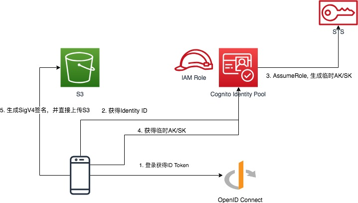
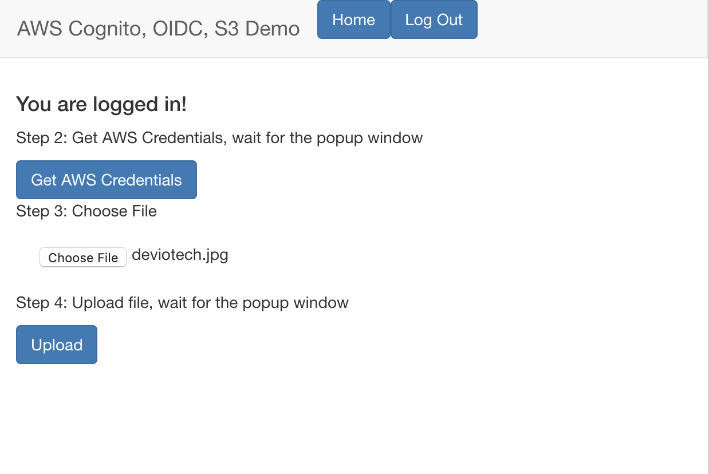
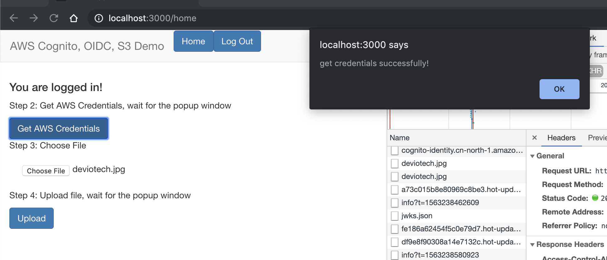
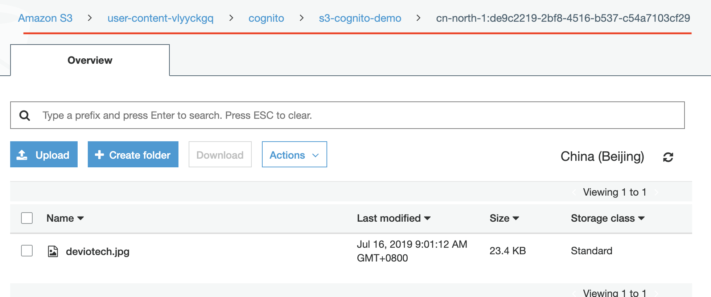

# Cognito, OIDC 实现 S3 精细化权限控制

在现代化应用中，用户文件通常存储在对象存储中，客户端通过 HTTP 的方式直接操作对象存储中的文件。
在实际应用过程中，我们经常遇到这样的需求：只允许用户 上传/下载/删除/修改(CRUD) 自己的文件。
本文将探讨利用 Amazon Cognito Identity Pool, OpenID Connect 实现精细化权限控制，限制用户只
能访问自己的文件。

[Amazon S3](https://aws.amazon.com/s3/) 是一个对象存储服务，非常适合存储海量文件。
它不仅支持从服务器端上传/下载 S3 中的内容，同时允许客户从客户端直接上传/下载 S3 中的资源。

[Amazon Cognito Identity Pool](https://docs.aws.amazon.com/zh_cn/cognito/latest/developerguide/cognito-identity.html) 
可以为您的用户创建唯一身份，并将它们与身份提供商联合。有了身份池，您便可以获取权限受限的
临时 AWS 凭证以访问其他 AWS 服务。

[OpenID Connect](https://openid.net/connect/) 是在基于 OAuth 2.0 协议的基础上提供通过 API 进行身份交互的规范。


## 实验前提

1. 本文将使用 [Auth0](https://auth0.com) 作为用户库。请注册 Auth0 账户，并按照
[文档](https://auth0.com/docs/dashboard/guides/applications/register-app-spa)添加 **application**。 
这并不要求用户一定使用 Auth0, 只要是支持 [OpenID Connect](https://openid.net/connect/) 标准的用户库都
可以使用次方法。

2. 本文架构部署使用 [**terraform**](https://www.terraform.io/) 一键部署AWS 资源，
请在本机安装 terraform, 并配置好[AWS Credentials](https://docs.aws.amazon.com/cli/latest/userguide/cli-configure-files.html)

3. Demo 包含前端 Web 应用，使用 yarn 做依赖管理，请自行安装 [**yarn**](https://yarnpkg.com/en/)

4. 需要了解 OpenID Connect 的基本机制，包括 **Access Token**, **ID Token**.

5. 本文使用 AWS China Region, 如使用 AWS Global Region, 请参考
[AWS区域与终端节点](https://docs.aws.amazon.com/zh_cn/general/latest/gr/rande.html)修改 endpoint。


## 架构和原理




1. 客户端检测到用户未登陆，跳转到登陆授权页面。以下是跳转链接：

```http request
https://aws-cognito.auth0.com/authorize?client_id=n4JmCUjAA4P7cEIEC3KI9yy8Kt4COqOt
&response_type=token%20id_token
&redirect_uri=http%3A%2F%2Flocalhost%3A3000%2Fcallback
&scope=openid
&state=VkFD4yrt9C2S2_qd67Xs8MHcBhxh2li0
&nonce=xXaQ-2sQnBCwMbGc1y7e3r0KgbC5~3sO
&auth0Client=eyJuYW1lIjoiYXV0aDAuanMiLCJ2ZXJzaW9uIjoiOS4xMC4xIn0%3D
```

上述 HTTP request 中的 auth0Client 为 Auth0 增加的字段，非 OIDC 标准字段


2. 客户端向 OpenID Connect Provider(OIDC) 发起登录请求，登陆成功后，跳转回步骤1中的 
**redirect_uri**，并且在 HTTP URL 中包含 **access token** 和 **ID Token**。如下：

```http request
http://localhost:3000/callback#access_token=<access_token>
&expires_in=7200
&token_type=Bearer
& state=vaXfc.jDtU5sr37K75QRw.~ZI4E5uLDA
&id_token=<id_token>
```

服务器在授权成功后返回信息如上。其中包含 **id_token**.


3. 通过携带 ID Token 调用API, 获得用户在 Cognito Identity Pool 中的 **Identity ID**.

```shell
POST https://cognito-identity.{region}.amazonaws.com.cn/
HEADER
    X-Amz-Target: AWSCognitoIdentityService.GetId
BODY
{
    "IdentityPoolId":"<cognito-identity-pool-id>",
    "Logins":{
        "<openid-connect-provider-domain>":"<id_token>"
    }
}
```
Cognito Identity Pool返回该用户的 **Identity ID**.
```shell
{
    "IdentityId": "<identity-id>"
}
```

`<openid-connect-provider-domain>` 是用户在 OIDC 的domain. 需要在 Cognito Identity Pool 中提前配置。该用户在下一次调用这个接口的时候，会返回相同的 Identity ID.

如果使用的 AWS China Region, 则 API 地址为 `https://cognito-identity.{region}.amazonaws.com.cn/`,
如果使用的是 AWS Global Region, 则 API 地址为 `https://cognito-identity.{region}.amazonaws.com`

4. Cognito Identity Pool 调用 STS 服务，生成临时 AK/SK, 该步骤由 Cognito Identity Pool 自动完成，
对用户不可见。

5. 通过步骤3中的 **Identity ID** 和步骤2中的 **ID Token** 换取该用户的临时 **AK/SK**

```shell
POST https://cognito-identity.{region}.amazonaws.com.cn/
Header
    X-Amz-Target: AWSCognitoIdentityService.GetCredentialsForIdentity
BODY
{
    "IdentityId":"<identity-id>",
    "Logins":{
        "<openid-connect-provider-domain>":"<id_token>"
    }
}
```

6. 通过 AK/SK 完成 SigV4 签名，然后直接上传文件到S3.

通过在 Cognito Identity Pool 配置 Authenticated Role 的权限，所有认证后的用户都具备该 Role 的权限。

Authenticated Role 所具有的 Policy 配置如下, 将其中的 `<s3-bucket-name>` 和 `<app-name>` 替换为实际使用的值。
`${cognito-identity.amazonaws.com:sub}` 是一个变量，其实际内容为该用户在 Cognito Identity Pool 中的 `Identity ID`。

```json
{
    "Version": "2012-10-17",
    "Statement": [
        {
            "Sid": "ListYourObjects",
            "Effect": "Allow",
            "Action": "s3:ListBucket",
            "Resource": [
                "arn:aws-cn:s3:::<s3-bucket-name>"
            ],
            "Condition": {
                "StringLike": {
                    "s3:prefix": [
                        "cognito/<app-name>/${cognito-identity.amazonaws.com:sub}"
                    ]
                }
            }
        },
        {
            "Sid": "ReadWriteDeleteYourObjects",
            "Effect": "Allow",
            "Action": [
                "s3:GetObject",
                "s3:PutObject",
                "s3:DeleteObject"
            ],
            "Resource": [
                "arn:aws-cn:s3:::<s3-bucket-name>/cognito/<app-name>/${cognito-identity.amazonaws.com:sub}",
                "arn:aws-cn:s3:::<s3-bucket-name>/cognito/<app-name>/${cognito-identity.amazonaws.com:sub}/*"
            ]
        }
    ]
}
```
在 Authenticated Role 中配置如上的策略，便可以实现用户只允许**上传/下载/删除/列出**自己的文件。

## Demo 快速部署

[点击此处访问 GitHub Repo](https://github.com/lab798/aws-s3-cognito-openid-lab)

本文使用 [Terraform](https://www.terraform.io/) 作为自动化资源创建工具，Terraform IT 是一款基础架构自动化编排工具，
如尚未安装，请按照[文档](https://learn.hashicorp.com/terraform/getting-started/install)下载并安装。

1. 注册 Auth0 帐号，并添加 Application. 详细步骤请查看 [Auth0 操作手册](https://auth0.com/docs/dashboard/guides/applications/register-app-spa)。
请注意，此处不强制使用 Auth0, 只要符合 OIDC 规范即可。记录下 Application 的 **Domain** 和 **Client ID**。
在 **Settings -> Allowed Callback URLs** 中输入 `http://localhost:3000/callback`

2. 登陆 AWS 控制台，在 [IAM Identity Provider](https://console.amazonaws.cn/iam/home#/providers) 中点击 **Create Provider**,

3. 在 **Provider Type** 中选择 **OpenID Connect**; 在 **Provider URL** 中输入 Auth0 的 **Domain** 字段
(必须是https://开头); 在 **Audience** 中输入 Auth0 的 **clientID**

4. 在 **terraform/variables.tf** 中修改变量的值。参数说明请参考注释

5. 通过 Terraform 自动化部署 Cognito 及相关 IAM Role, IAM Policy
```shell
cd terraform
terraform init
terraform apply
```

6. 将 terraform 的输入 拷贝到 `src/config.json` 中，并保存配置文件

7. 在项目根目录下安装 Web 依赖, 并运行前端程序 
```shell
cd ..
yarn install
yarn start
```

8. 程序正常运行，登录后，选择文件，并上传

> 如果该系统部署在 AWS Global Region, 请务必将 IAM Policy 中的 `aws-cn` 改成 `aws`, 
> Cognito 的 endpoint 修改为 https://cognito-identity.{region}.amazonaws.com/


## 运行 Demo

1. 点击页面上的 **Log In**  按钮，跳转到 Auth0 的认证页面，输入用户名密码。
等待页面跳转回 Web App, 显示已经登陆，页面如下:



2. 点击 **Get AWS Credentials** 按钮。等待弹出对话框



3. 点击 **Choose file** 选择要上传的文件，此处只支持图片

4. 点击 **Upload** 按钮，等待文件上传成功，并弹出对话框

5. 查看 S3 Bucket, 发现 S3 中图片的 keyname 包含 **Cognito Identity ID**



至此，实验成功。想知道客户端的实现方式可查看, `src` 文件夹下的前端代码。
demo 程序的主要逻辑代码在 `src/Auth.js` 和 `src/Home.js`。

该解决方案也支持符合使用 SAML 标准的 Auth 系统。详细内容请
参考 [SAML Identity Providers](https://docs.aws.amazon.com/cognito/latest/developerguide/saml-identity-provider.html)


## 如何销毁资源

1. 删除 S3 内的文件

2. 在 `terraform` 目录下运行 `terraform destroy`

3. 在 [IAM Identity Provider](https://console.amazonaws.cn/iam/home#/providers) 
中删除之前创建的 **Identity Provider**

## 参考文档

[OpenID](https://docs.aws.amazon.com/cognito/latest/developerguide/open-id.html)

[Auth0 配置](https://auth0.com/docs/integrations/integrating-auth0-amazon-cognito-mobile-apps)

[JS S3 上传示例代码](https://docs.aws.amazon.com/cognito/latest/developerguide/getting-credentials.html#getting-credentials-1.javascript
)
